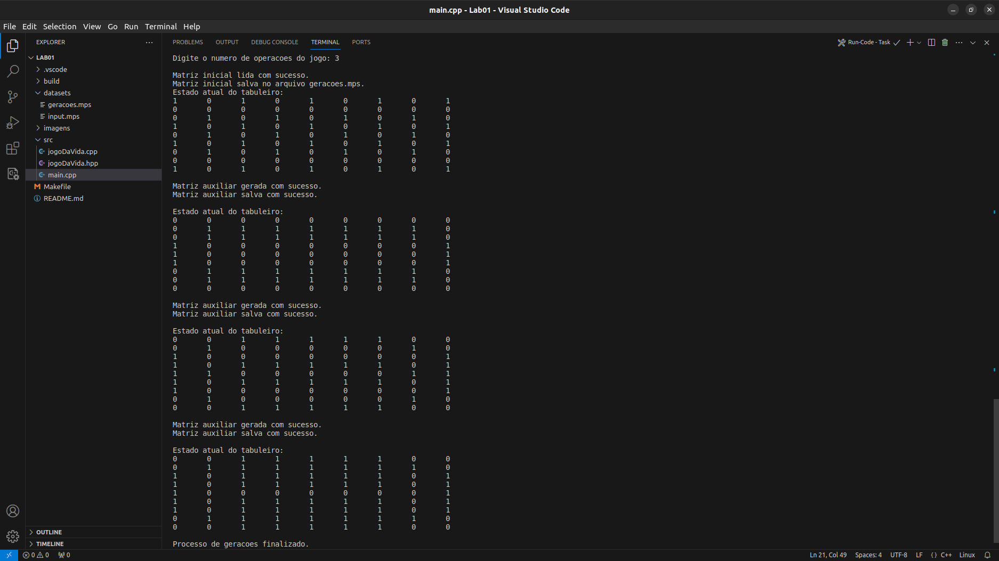

           d8888 8888888888 8888888b.   .d8888b.  |  
          d88888 888        888  "Y88b d88P  Y88b | 
         d88P888 888        888    888 Y88b.      |
        d88P 888 8888888    888    888  "Y888b.   |  Algoritmos e
       d88P  888 888        888    888     "Y88b. |  Estruturas de Dados I
      d88P   888 888        888    888       "888 |
     d8888888888 888        888  .d88P Y88b  d88P |  
    d88P     888 8888888888 8888888P"   "Y8888P"  |
                                              
                                                                                             
___

    <h1>Laboratório 0 de AEDS  (<i>Jogo da Vida</i>)</h1>

   

   
   
   
   </a>
   

   
 

   
 

   Esse é o repositório de uma atividade proposta no laboratório da disciplina de Algoritmos e Estruturas de Dados I, ministrada no Campus Divinópolis do CEFET-MG pelo professor Michel Pires Da Silva.

   Iniciando a disciplina, essa atividade foi proposta como um aquecimento. Dessa forma, também seria possível revisar conteúdos anteriores com as ferramentas que foram propostas e recomendadas no início do período letivo. Em especial, é possível citar a adoção do Ubuntu (ou qualquer outra distribuição Linux) e do VS Code em geral por parte da turma.

## Objetivo:
Parafraseando o documento guia da atividade: 

> "_O Jogo da Vida é um autômato celular que evolui de acordo com regras simples, mas
gera padrões complexos. Ele é representado por uma matriz 2D de células, cada uma
podendo estar viva ou morta."_

>_"O objetivo deste trabalho é revisar os conceitos de manipulação de matrizes, controle
de fluxo e lógica de jogo."_

No contexto da disciplina, podemos então entender o Jogo da Vida como um processo de manipulção de matrizes 2D, que precisa obedecer a uma lógica de programação para poder cumprir com um conjunto de regras. A intenção aqui é que o programa seja capaz de verificar a matriz com base nessas regras, e que consiga reproduzir o que acontece quando elas são aplicadas diversas vezes sobre matrizes resultantes. Também é importante que o programa guarde em um arquivo a matriz original e as novas matrizes que são geradas.

### Regras:
1. O tabuleiro é iniciado na forma de uma matriz quadrática de dimensão NxN;
2. O tabuleiro é iniciado aleatoriamente com células vivas (1) e mortas (0);
3. Uma célula viva (1) com menos de dois vizinhos vivos morre (solidão);
4. Uma célula viva (1) com mais de três vizinhos vivos morre (superpopulação);
5. Uma célula viva (1) com dois ou três vizinhos vivos vive;
6. Uma célula morta (0) com exatamente três vizinhos vivos se torna viva (reprodução).

## Metodologia:
Antes de iniciar propriamente o projeto, também foi necessário levar em conta algumas considerações que foram dadas durante as aulas de laboratório:

- **Forneça a prmieira matriz (aleatoriamente ou produzida manualmente):** Ela pode ser encontrada e/ou modificada no arquivo _input.mps_, localizado na pasta _datasets_;

- **Tenha cerca do dobro de células mortas (0) para a quantidade de células vivas (1)**: Isso é relevante para que a execução possa ter várias gerações até que o tabuleiro zere completamente.

- **No terminal, apresentar apenas mensagens de execução de algoritmo e processo finalizado**: A prioridade é que o arquivo _gerações.mps_ contenha o histórico de modificações das matrizes.

- **O ideal é trabalhar com 2 matrizes, que podem ser descarregadas uma na outra**: Essa é literalmente a base da lógica por trás do projeto e da modificação das matrizes, que foi discutida durante as aulas de laboratório como uma parte relevante da solução.

    <h3>Linguagem escolhida: C++</h3>

## Funções do projeto:
- `int getNumGeracoes()` : é uma função que pode ao usuário, através do terminal, o número de gerações de novas matrizes na execução. Assim, retorna esse valor como um inteiro.

- `int tamMatrizInicial()` : é uma função que lê a primeira linha do arquivo _input.mps_ e  retona o número N que representa a dimensão da matriz NxN. 
  
- `void lerMatrizInicial(int **matrizInicial, int tamMatriz1)` : recebe o ponteiro da matriz inicial (criada na _main_) e o tamanho da matriz obtido pela função anterior, e abre o arquivo _input.mps_ novamente para fazer a leitura da matriz que está contida nele.

- `void exibirMatrizAtual(int **matrizInicial, int tamMatriz1)` : recebe o ponteiro da matriz inicial para exibir no terminal o que seria o estado atual do tabuleiro. 

- `void salvarMatrizInicial(int **matrizInicial, int tamMatriz1)` : recebe o ponteiro da matriz inicial (criada na _main_) e o tamanho da matriz para salvar a matriz obtida através do arquivo _input.mps_ no arquivo _geracoes.mps_.

- `void gerarMatrizAuxiliar(int **matrizInicial, int **matrizAuxiliar, int tamMatriz1)` : recebe o ponteiro da matriz inicial, o de uma matriz auxiliar e seu tamanho para preencher a matriz auxiliar, com base nas regras do Jogo da Vida. Para isso, é necessário também percorrer a matriz internamente com laços de repetição que verifiquem células válidas da matriz. A partir disso, a função percorre a matriz inicial com um contador de vizinhos vivos para cada célula, e aplica as condições de vida ou morte da célula, assim preenchendo a matriz auxiliar.

- `void salvarMatrizAuxiliar(int **matrizAuxiliar, int tamMatriz1)` : recebe o ponteiro da matriz auxiliar, junto de seu tamanho, para salvar a matriz obtida no arquivo _geracoes.mps_.

- `void editarMatrizInicial(int **matrizInicial, int **matrizAuxiliar, int tamMatriz1)` : essa função recebe os ponteiros das matrizes inicial e auxiliar para substituir o conteúdo da matriz inicial pelo conteúdo da matriz auxiliar. Assim, uma nova matriz auxiliar pode ser gerada e sobrescrita, que é salva no arquivo _geracoes.mps_ e mais uma vez pode sobrescrever a matriz inicial. Após isso, o terminal também mostra o tabuleiro após as mudanças. Assim, o ciclo é repetido em um laço de repetição que equivale a quantidade de gerações desejada pelo usuário.

## Resultados encontrados:
Considerando a necessidade da disciplina em testar programas em um ambiente Linux, a atividade desse repositório foi testada em uma máquina com as seguintes especificações:

### Teste 1: Matriz 5x5:
#### _input.mps_:
    5
    1 0 1 0 1 
    0 0 0 0 0 
    0 1 0 1 0 
    0 0 0 0 0 
    1 0 1 0 1 

#### _terminal_:

#### _geracoes.mps:_

___
### Teste 2: Matriz 7x7:
#### _input.mps_:
    7
    1 0 1 0 1 0 1
    0 0 0 0 0 0 0
    0 1 0 1 0 1 0
    1 0 1 0 1 0 1
    0 1 0 1 0 1 0
    0 0 0 0 0 0 0
    1 0 1 0 1 0 1

#### _terminal_:

#### _geracoes.mps:_

___
### Teste 3: Matriz 9x9:
#### _input.mps_:
    9
    1 0 1 0 1 0 1 0 1
    0 0 0 0 0 0 0 0 0
    0 1 0 1 0 1 0 1 0
    1 0 1 0 1 0 1 0 1
    0 1 0 1 0 1 0 1 0
    1 0 1 0 1 0 1 0 1
    0 1 0 1 0 1 0 1 0
    0 0 0 0 0 0 0 0 0
    1 0 1 0 1 0 1 0 1

#### _terminal_:

#### _geracoes.mps:_

## Informações adicionais da máquina de testes:

  

## Principais arquivos do projeto:
Aqui estão listados os principais arquivos que o programa precisa para que a lógica implementada na atividade funcione devidamente. Arquivos de compilação/execução serão citados posteriormente:

### datasets:
- `input.mps` : Possui na primeira linha um número que repesenta as dimensões da matriz quadrática. As próximas linhas possuem as linhas da matriz inicial em si. 

- `geracoes.mps` : É um arquivo vazio, que vai armazenar tanto a matriz original quanto as novas matrizes que serão geradas.

### src:
- `main.cpp` : Aqui, as funções dos arquivos de cabeçalho são chamadas e variáveis são criadas a partir delas. Apresenta, de forma resumida, a lógica por trás da lógica aplicada para a resolução do exercício.
- `jogoDaVida.hpp` : É um arquivo de cabeçalho para as funções do código.
- `jogoDaVida.cpp` : É um arquivo que contém todas as funções usadas no código.

## Compilação e execução do projeto:
O projeto disponibilizado possui um arquivo Makefile (disponibilizado pelo professor Michel) que realiza todo o procedimento de compilação e execução. Para tanto, temos as seguintes diretrizes de execução:

| Comando | Função                                                                                           |                     
| -----------------------| ------------------------------------------------------------------------------------------------- |
|  `make clean`          | Apaga a última compilação realizada contida  na pasta build                                        |
|  `make`                | Executa a compilação do programa utilizando o gcc, e o resultado vai para a pasta build           |
|  `make run`            | Executa o programa da pasta build após a realização da compilação                                 |

## Contatos:
✉️ <i>silvagomes881@gmail.com</i>
